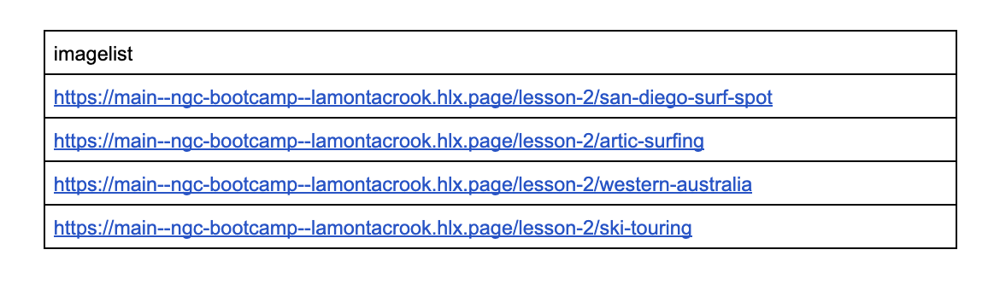
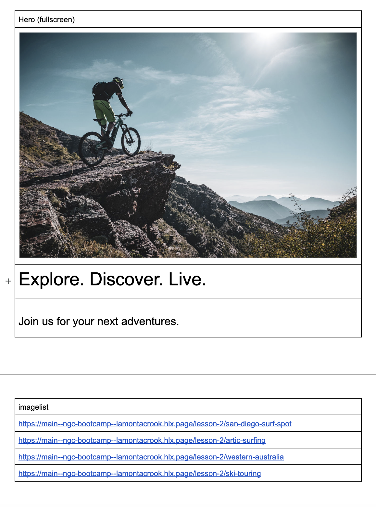

# NGC Bootcamp

## Create Image List Block

We will now create brand new block called image list.  

1. Create a new folder un blocks called `/imagelist` with new files under it called `imagelist.css` and `imagelist.js`.

In our new file `imagelist.js` lets add the necessary code that a block requires.

```javascript
export default async function decorate(block) {

}
```
2.  To our document we now want to outline the block on in our document.  You will find in [this](https://drive.google.com/drive/folders/1eEVfGCjSto8oStG6IUZkgg7-YTojbSKD?usp=sharing) directory 4 articles to use.  Copy them into your google directory and preview them.  Now in our document let's create a table with 5 rows and 1 column.  In the first row we will define the name of our block *imagelist* and then into each line we will paste a link to your newly previewed articles.



Lastly, we need to insert a horizontal line between our hero block and imagelist.  This will place a hero and imagelist into seperate sections which we will use for our styling.



3. Before we begin building out block, let's inspect each article.  You will see at the bottom or the article is the metadata table.  This will provide data to our imagelist of the title and the description for the imagelist.  Our imagelist block will use this with the first image of the page to render the imagelist.

4. Now let's start building our imagelist block.  First let's build a function that fetches our article fragments.

```javascript
async function loadFragment(path) {
  if (path && path.startsWith('/')) {
    const resp = await fetch(path);
    if (resp.ok) {
      const parser = new DOMParser();
      return parser.parseFromString(await resp.text(), 'text/html');
    }
  }
  return null;
}
```

This function will take a path, fetch the article with that path and then return the content.

4. Next we need to build a function that will grab the metadata from articles.

```javascript
function getMetadata(name, doc) {
  const attr = name && name.includes(':') ? 'property' : 'name';
  const meta = [...doc.head.querySelectorAll(`meta[${attr}="${name}"]`)].map((m) => m.content).join(', ');
  return meta || '';
}
```

5. Now we will call this new function inside of our decorate entry point.  We will loop through the rows and grab the href of each link and then pass it to our `loadFragment()` function.

```javascript
export default async function decorate(block) {
  [...block.children].forEach(async (div) => {
    const link = div.querySelector('div>div>a');
    const path = link ? link.getAttribute('href') : block.textContent.trim();
    const doc = await loadFragment(path);
    div.remove();

    
  });
}
```

6. Finally we will want to complete the DOM manipulation for the imagelist.  

We will first get the necessary content, including hero image, title and description.

```javascript
const heroPicture = doc.querySelector('picture');
const title = getMetadata('og:title', doc);
const desc = getMetadata('og:description', doc);
```

Now let's create new div called `card` and begin adding our content.

```javascript
const card = document.createElement('div');
card.classList.add('card');

const h2 = document.createElement('h2');
h2.textContent = title;

const p = document.createElement('p');
p.textContent = desc;

card.appendChild(heroPicture);
card.appendChild(h2);
card.appendChild(p);
```

Lastly, let's make this card a hyperlink to the article.

```javascript
const a = document.createElement('a');  
a.href = doc.querySelector('link').href;
a.appendChild(card);
```

Finally, we will add this to the block.

```javascript
block.appendChild(a);
```

For reference this is the complete code for the block.

```javascript
function getMetadata(name, doc) {
  const attr = name && name.includes(':') ? 'property' : 'name';
  const meta = [...doc.head.querySelectorAll(`meta[${attr}="${name}"]`)].map((m) => m.content).join(', ');
  return meta || '';
}

async function loadFragment(path) {
  if (path && path.startsWith('/')) {
    const resp = await fetch(path);
    if (resp.ok) {
      const parser = new DOMParser();
      return parser.parseFromString(await resp.text(), 'text/html');
    }
  }
  return null;
}

export default async function decorate(block) {
  [...block.children].forEach(async (div) => {
    const link = div.querySelector('div>div>a');
    const path = link ? link.getAttribute('href') : block.textContent.trim();
    const doc = await loadFragment(path);
    div.remove();

    const heroPicture = doc.querySelector('picture');
    const title = getMetadata('og:title', doc);
    const desc = getMetadata('og:description', doc);

    const card = document.createElement('div');
    card.classList.add('card');

    const h2 = document.createElement('h2');
    h2.textContent = title;

    const p = document.createElement('p');
    p.textContent = desc;

    card.appendChild(heroPicture);
    card.appendChild(h2);
    card.appendChild(p);

    const a = document.createElement('a');  
    a.href = doc.querySelector('link').href;
    a.appendChild(card);

    block.appendChild(a);
  });
}
```

7. Finally, let's style our imagelist.

```css
main .imagelist {
  display: flex;
  flex-direction: row;
  overflow-x: scroll;
  max-width: 1920px;
}

main .imagelist .card {
  display: flex;
  flex-direction: column;
  max-width: 400px;
  width: 320px;
  padding: 20px;
  margin: 20px;
  height: 626px;
}

main .imagelist .card:hover {
  background-color: #eee;
}

main .imagelist .card img {
  object-fit: cover;
  object-position: 0 25%;
  height: 249px;
  width: 100%;
}

main .imagelist a:hover {
  text-decoration: none;
  color: var(--text-color);
}

main .imagelist-wrapper {
  padding: unset;
  max-width: unset;
}

main .imagelist a:any-link {
  color: var(--text-color);
  text-decoration: none;
}
```
