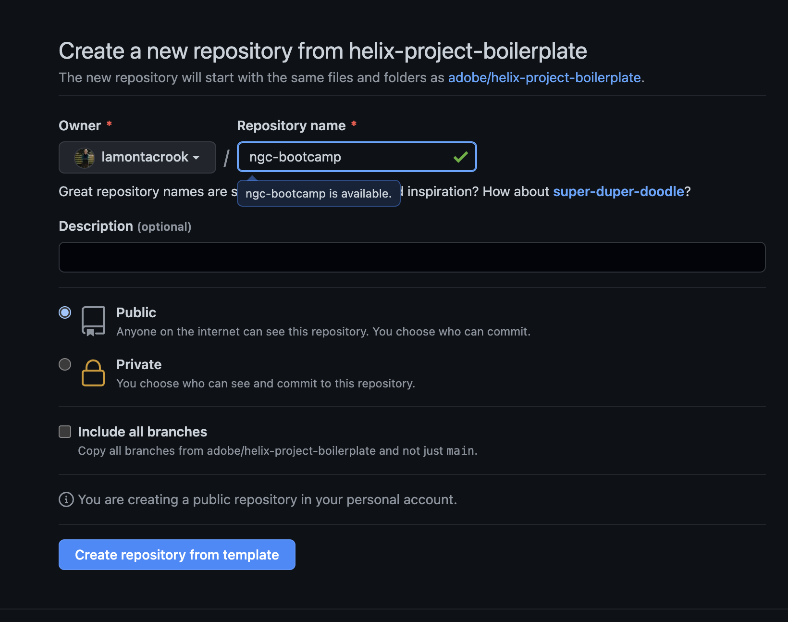
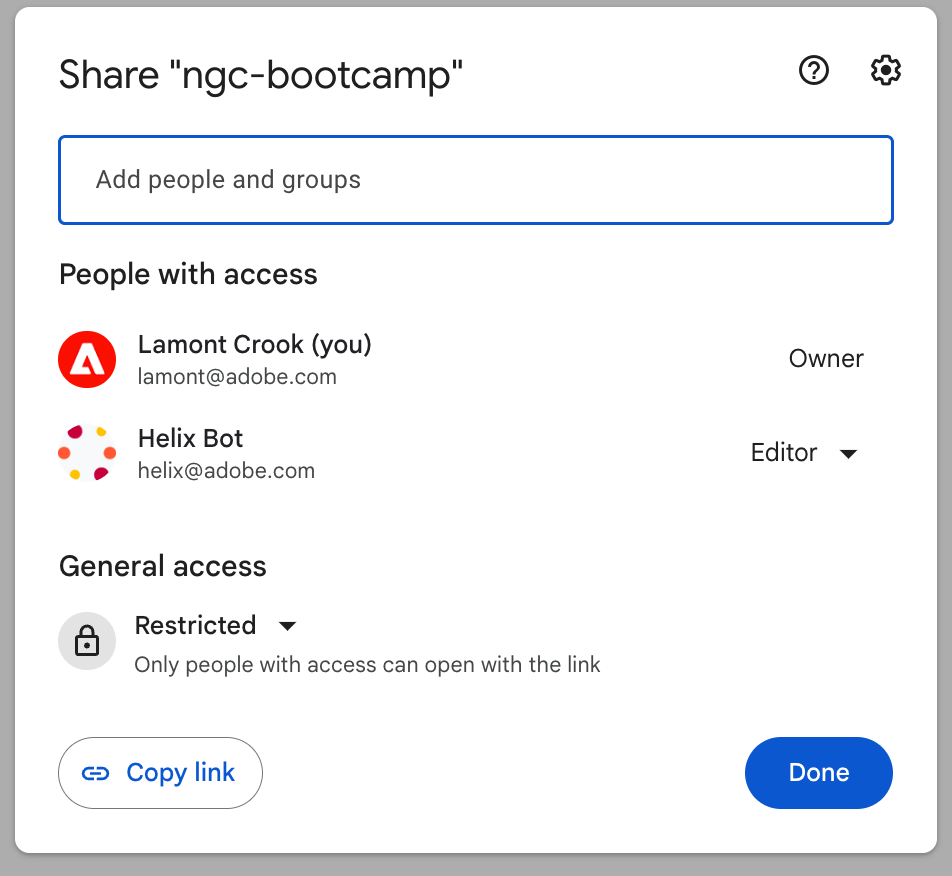
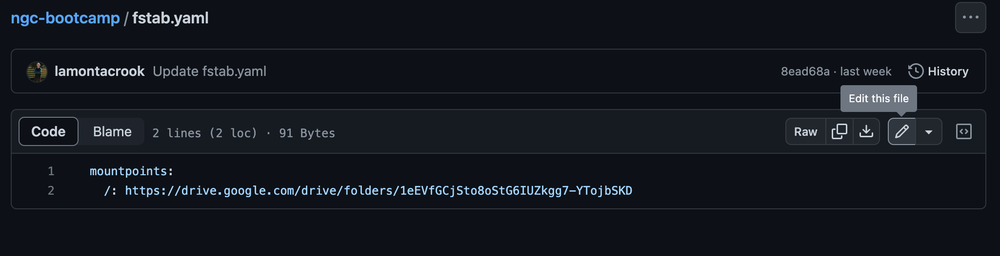
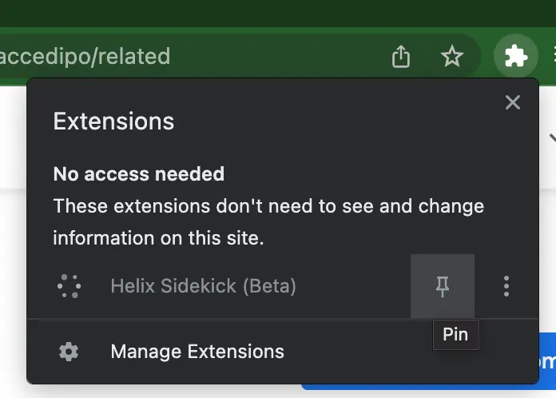
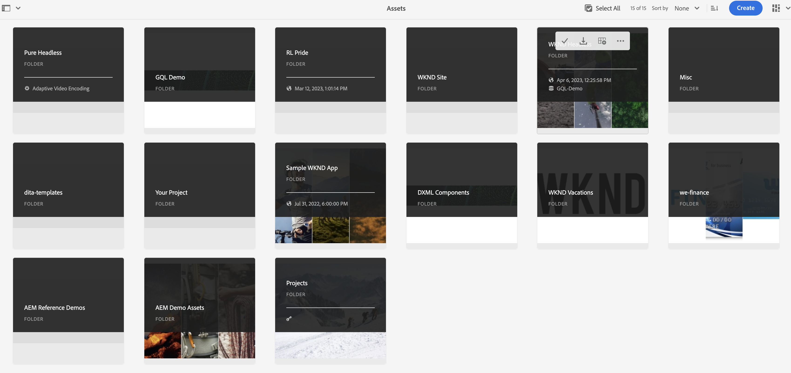
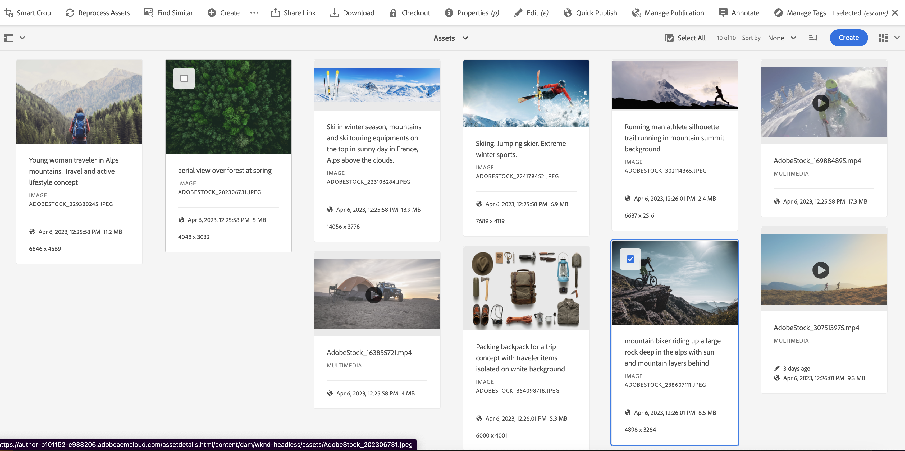
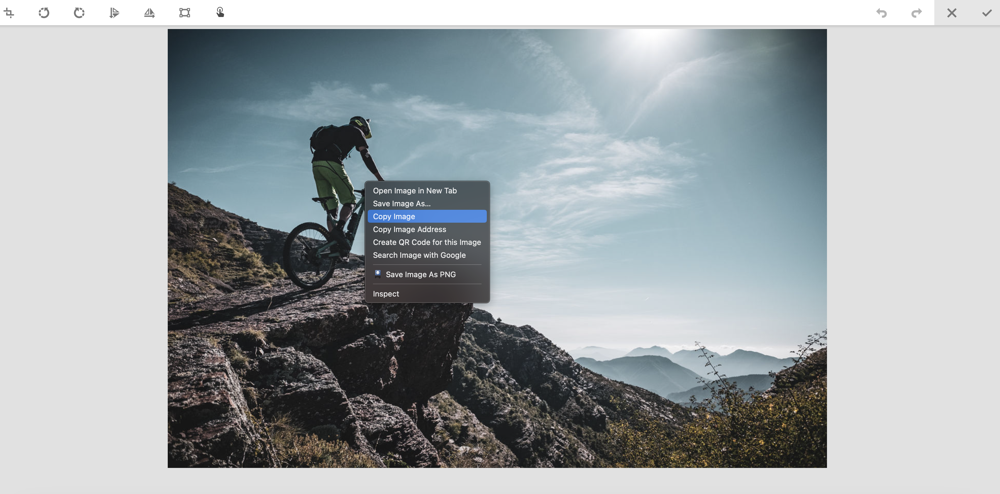
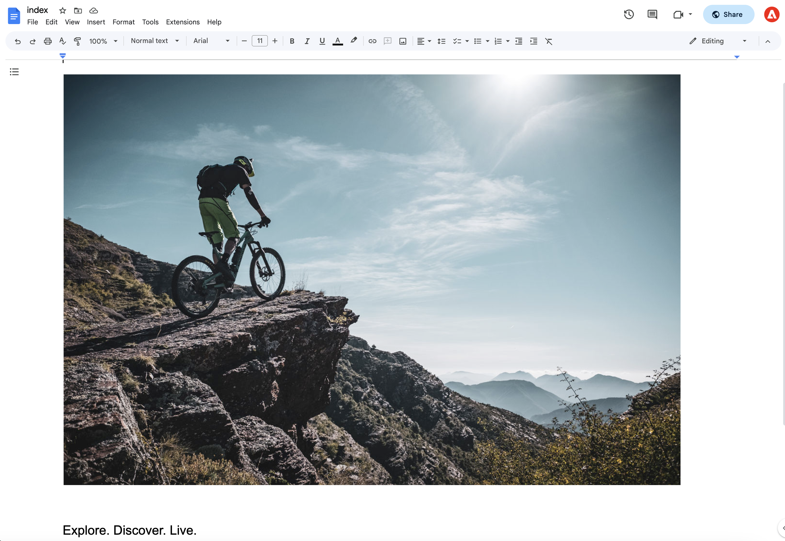
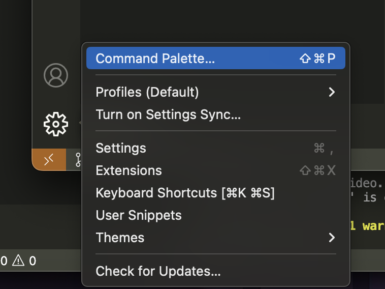

# NGC Bootcamp

## Setup Environment

Setup Environment
What you need.

* [Node.js v16+](https://nodejs.org/en/)
* [npm 6+](https://www.npmjs.com/)
* [Git](https://git-scm.com/)

We would advise using NVM to address having multiple versions of node.js on the same machine.

We will be using Visual Studio Code in the lab. Ensure that you have GitHub Extension installed.

For the session everyone will be creating a site using Google Drive or Sharepoint and Github. Come to the session with your own Github account. We would recommend using a personal account. You may use Google Drive or Sharepoint, however you will need to have the ability to share the folder outside of your organization. A personal Google Drive account might be the easiest.

Ensure that you have privileges to install libraries globally on your computer during the session.

To validate that you have everything setup correctly, open visual studio code an select "Terminal" from menu bar and select "New Terminal". Type

```bash
node -v
```

If node was correctly installed, it will print out the version. For NPM, you can type:

```bash
npm -v
```

And for git, you can type:

```bash
git -v
```

If everything is installed correctly, all of these commands will repond with the version installed.

---

## Setup First Project

1. Navigate to the [boilder plate repository](https://github.com/adobe/helix-project-boilerplate).  Click on Use Template > Create New Repository.


**NOTE:** The *Use Template* button will not appear if you are not logged into Github.

You may give the repository any name that you'd like.



2.  We now need to add the Franklin Bot by clicking [here](https://github.com/apps/helix-bot/installations/new)

In the Repository access settings of the Franklin bot, make sure you select *Only Select Repositories* (not All Repositories). Then select your newly created repo, and click Save.

3. Let's now go to google drive.  We can also use Sharepoint which will be similar setup.  In google drive we want to create an new folder and share that folder with `helix@adobe.com`.

4. Copy the link to the folder and we will want to use that within our new repository. 

**Note:** Make sure you selecting the link for the folder that contains the index file.



You can now return to the newly created github repository and add the directory to the `fstab.yaml` file.  Select the file and hit edit to edit the file.



Click *Commit changes*.

5. We can now install the sidekick [chrome extension](https://chrome.google.com/webstore/detail/helix-sidekick-beta/ccfggkjabjahcjoljmgmklhpaccedipo).  After add the extension to Chrome, don't forget to pin it.



To setup the Chrome extension, right click the extension while you are on your github repository and select *Add project*.

4. Now return to your google folder and create a new document named `index`.  To the document, let's add an image and text.  Return to the AEM environment from the headless lab and navigate to assets.  



Select the folder from your project and the assets folder inside of that. Select the asset you want to choose and click 'e' to edit. 



Copy the image to your clipboard and paste into the document.



5. Not let's add some text that will be the overlay on the image.


<h1>Explore. Discover. Live.</h1>



6. Click on the newly installed sidekick extension and click *Preview*.  You should now be able to view your page in the browser.

7. We can now start customizing our site. Clone the the newly created repository to your local directory.  

In Visual Studio Code, click the gear icon on the lower left corner and select command pallete.



Then choose git: Clone.


Paste into the box the URL from your newly created repository.

8. When that is complete let's setup NGC to run locally for development.  Run this command from the terminal.

`npm install -g @adobe/helix-cli`

Once complete, you can run `hlx up` to start the local server.

NOTE: If you are on windows you may need to install and run in the adminstrator terminal.

9. Let's update `style.css` and add fonts to project.  You can download the fonts from [here](https://github.com/lamontacrook/ngc-bootcamp/tree/lesson-1/styles/fonts).  Simply create a folder under `styles` named `fonts` and save the downloaded fonts.

Import fonts in `lazy-styles.css`.

```css
@font-face {
  font-display: block;
  font-family: wknd-icon-font;
  font-style: normal;
  font-weight: 400;
  src: url(./fonts/wknd-icon-font.ttf) format("truetype"), 
    url(./fonts/wknd-icon-font.woff) format("woff"), 
    url(./fonts/wknd-icon-font.svg#wknd-icon-font) format("svg")
}

@font-face {
  font-display: block;
  font-family: adobe-clean-regular;
  font-style: normal;
  font-weight: 400;
  src: url(./fonts/AdobeClean-Regular.ttf) format("truetype")
}

@font-face {
  font-display: block;
  font-family: adobe-clean-light;
  font-style: normal;
  font-weight: 400;
  src: url(./fonts/AdobeClean-Light.ttf) format("truetype")
}

```

In `styles.css` change:

```css
  /* fonts */
  --body-font-family: "wknd-icon-font" !important;
  --heading-font-family: adobe-clean-regular, Arial, Helvetica, sans-serif;
```
