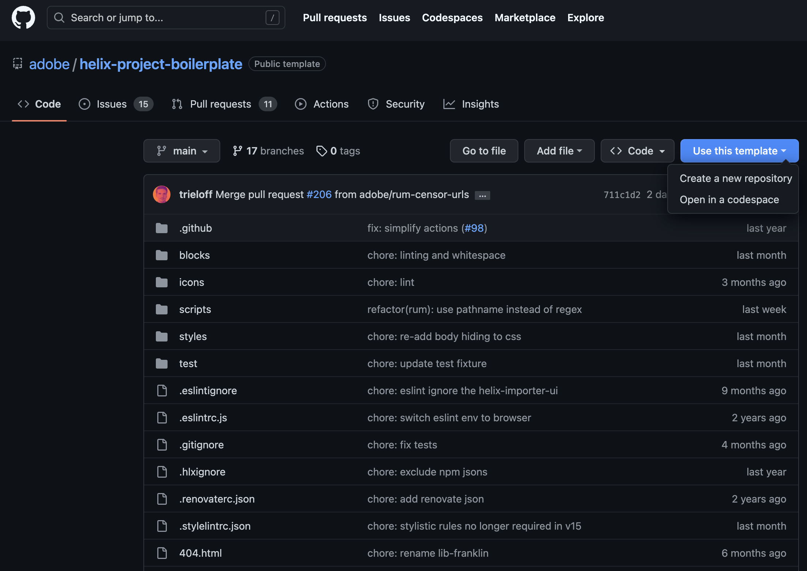

# NGC Bootcamp

## Setting up Respository

###Prerequisites:

1. You have a GitHub account, and understand Git basics.
2. You have a Google account.
3. You understand the basic HTML, CSS, and JavaScript.
4. You have Node/npm installed for local development.

Get Started with the Franklin Boilerplate Repository Template
The fastest and easiest way to get started following AEM Franklin best practices is to create your repo using the Franklin boilerplate GitHub repo as a template.

1. Navigate to the [boilder plate repository](https://github.com/adobe/helix-project-boilerplate).  Click on Use Template > Create New Repository.



You may give the repository any name that you'd like.


2.  We now need to add the Franklin Bot by clicking [here](https://github.com/apps/helix-bot/installations/new)

In the Repository access settings of the Franklin bot, make sure you select *Only Select Repositories* (not All Repositories). Then select your newly created repo, and click Save.

3. Let's now go to google drive.  We can also use Sharepoint which will be similar setup.  In google drive we want to create an new folder and share that folder with `helix@adobe.com`.

4. Copy the link to the folder and we will want to use that within our new repository. 


You can now return to the newly created github repository and add the directory to the `fstab.yaml` file.  Select the file and hit edit to edit the file.


Click *Commit changes*.

5. We can now install the sidekick [chrome extension](https://chrome.google.com/webstore/detail/helix-sidekick-beta/ccfggkjabjahcjoljmgmklhpaccedipo).  After add the extension to Chrome, don't forget to pin it.


To setup the Chrome extension, click the extension while you are on your github repository and select *Add project*.

4. Now return to your google folder and create a new document named `index`.  To the document, let's add an image and text.  Open assets and navigate to assets > gql-demo > assets and select and asset and click 'e' to edit. Copy the image to your clipboard and paste into the document.

5. Not let's add some text that will be the overlay on the image.

Explore. Discover. Live.

7. Click on the newly installed sidekick extension and click *Preview*.  You should now be able to view your page in the browser.

6. We can now start customizing our site. Let's update `style.css` and add fonts to project.  You can download the fonts from [here](https://github.com/lamontacrook/ngc-bootcamp/tree/lesson-1/styles/fonts).  Simply create a folder under `styles` named `fonts` and save the downloaded fonts.

Import fonts in `lazy-styles.css`.

```css
@font-face {
  font-display: block;
  font-family: wknd-icon-font;
  font-style: normal;
  font-weight: 400;
  src: url(./fonts/wknd-icon-font.ttf) format("truetype"), 
    url(./fonts/wknd-icon-font.woff) format("woff"), 
    url(./fonts/wknd-icon-font.svg#wknd-icon-font) format("svg")
}

@font-face {
  font-display: block;
  font-family: adobe-clean-regular;
  font-style: normal;
  font-weight: 400;
  src: url(./fonts/AdobeClean-Regular.ttf) format("truetype")
}

@font-face {
  font-display: block;
  font-family: adobe-clean-light;
  font-style: normal;
  font-weight: 400;
  src: url(./fonts/AdobeClean-Light.ttf) format("truetype")
}

```

In `styles.css` change:

```css
  /* fonts */
  --body-font-family: "wknd-icon-font" !important;
  --heading-font-family: adobe-clean-regular, Arial, Helvetica, sans-serif;
```
